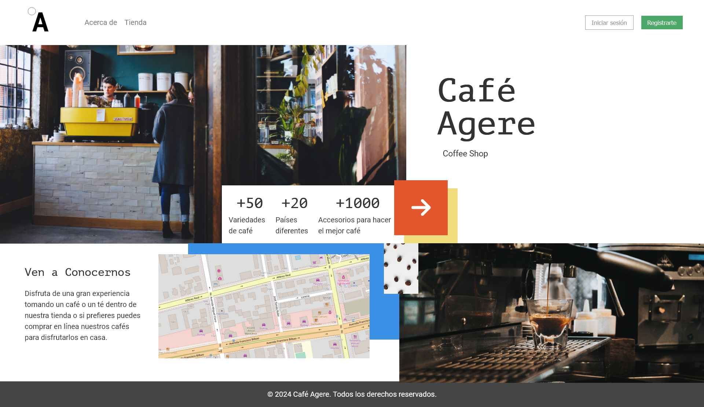

# Desafío Evaluado - El modelo de cajas y el layout

## Descripción

Este proyecto consiste en la creación de una maqueta para la home de un ecommerce para una cafetería. El objetivo es demostrar conocimientos sobre posicionamiento en CSS, además del uso de Sass y la metodología BEM.

## Requerimientos

### 1. Separar lógica visual del proyecto usando parciales, directivas `@import` y manifiesto

- Crear archivos parciales necesarios para el proyecto.
- Crear manifiesto del proyecto Sass.
- Agregar parciales en manifiesto usando la directiva `@import`.

### 2. Construir estructura HTML utilizando etiquetas semánticas

- Utilizar al menos 3 etiquetas semánticas de layout como `header`, `section`, `footer`, `nav` o `article`.

### 3. Crear clases semánticas utilizando nomenclatura de metodología BEM

- Agregar una clase bloque a la barra de navegación, a la navegación una clase de elemento y al botón una clase modificadora siguiendo las normas especificadas en la nomenclatura BEM.

### 4. Utilizar variables de Sass para reutilizar código CSS/SCSS

- Agregar variables de colores, fuentes, tamaño y grosor de fuentes siguiendo la guía de estilos.
- Utilizar al menos 5 variables en el proyecto.

### 5. Crear estilos base del proyecto

- Agregar estilos reset al proyecto.
- Agregar estilos base para tipografías del proyecto.

### 6. Identificar elementos que constituyen la página del proyecto web

- Definir los estilos en la página.
- Crear parciales para la página.
- Identificar colores de fondo usados en representación visual.
- Utilizar unidades de medidas relativas para que el layout sea fluido.
- Definir reglas a CSS/SCSS a utilizar en la página.
- Utilizar reglas de posición en elementos e imágenes.
- Usar `z-index` para sobreponer imágenes y bloques.

### 7. Crear estilos para componentes del proyecto web

- Identificar componentes a dar estilos.
- Crear parciales para componentes.
- Definir reglas CSS/SCSS a utilizar componentes.

## Estructura del Proyecto

```plaintext

├─────assets
│    ├───css
│    ├───img
│    └───sass
│        ├───abstracts
│        ├───base
│        ├───components
│        ├───layout
│        ├───pages
│        ├───theme
│        └───vendors
│
├── index.html
└── Readme.md
      
```

## Scrreenshots sitio web


